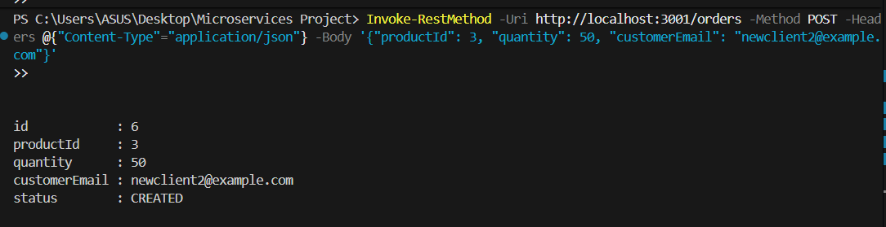
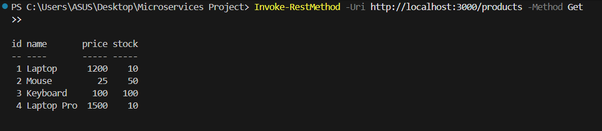
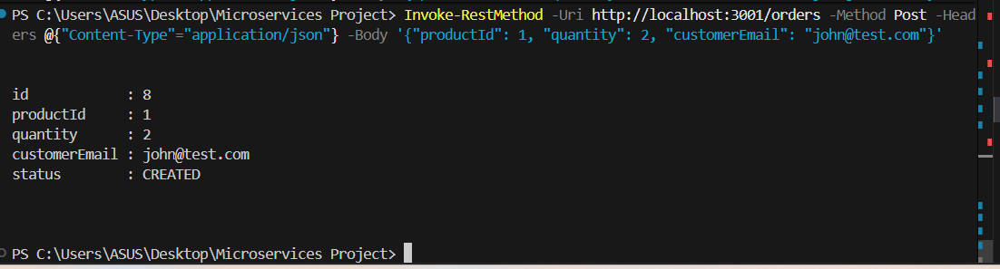
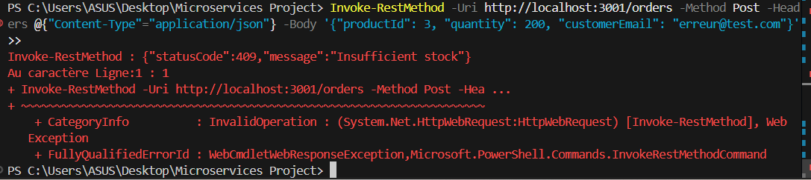
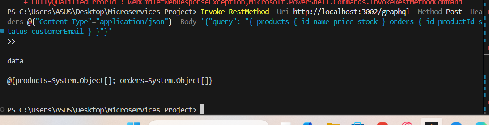
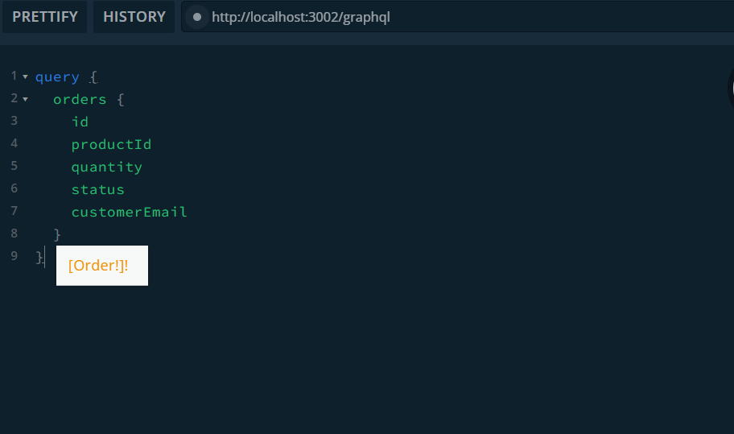
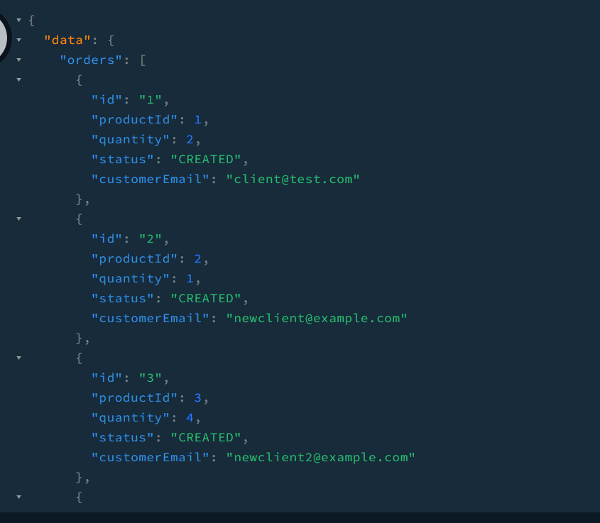

# Mini Plateforme de Commandes Distribuée (NestJS)

Ce dépôt contient la solution complète au TP sur l'architecture microservices (REST, GraphQL, gRPC, Kafka) avec NestJS.

## Architecture

Le projet est composé des 5 services suivants :

- **catalog-service** (REST, Port: 3000) : CRUD des produits.
- **stock-service** (gRPC, Port: 50051) : Validation et réservation synchrone du stock.
- **order-service** (REST/gRPC/Kafka, Port: 3001) : Création de commandes, appel gRPC pour le stock, et publication Kafka de l'événement `order.created`.
- **notification-service** (Kafka Consumer) : Écoute le topic `order.created` et log la notification.
- **query-service** (GraphQL, Port: 3002) : API GraphQL lisant les données agrégées depuis `catalog-service` et `order-service`.

## Prérequis

- Node.js 20+
- npm
- Docker Desktop (nécessaire pour exécuter Kafka)

## Démarrage Rapide

Pour démarrer l'infrastructure complète (Kafka, Zookeeper) en arrière-plan :

```bash
docker-compose up -d
```

Ensuite, vous devez démarrer chaque microservice dans son propre terminal. Par exemple :
```bash
cd catalog-service
npm run start:dev
```
*(Faites de même pour `stock-service`, `order-service`, `query-service` et `notification-service`).*

---

## Guide de Test Étape par Étape (Pour Windows / PowerShell)

Une fois que les services tournent, ouvrez un **nouveau terminal PowerShell** et exécutez ces requêtes pour tester les différentes briques de l'architecture.

### Étape 1 : Tester le `catalog-service` (REST API)

Ce service gère la base de données des produits.

**A. Créer un nouveau produit :**

```powershell
Invoke-RestMethod -Uri http://localhost:3000/products -Method Post -Headers @{"Content-Type"="application/json"} -Body '{"name": "Laptop Pro", "price": 1500, "stock": 10}'
```




**B. Lister les produits disponibles :**

```powershell
Invoke-RestMethod -Uri http://localhost:3000/products -Method Get
```




### Étape 2 : Tester `order-service` -> `stock-service` (Validation gRPC)

L'`order-service` est un orchestrateur. Il communique avec le `stock-service` via **gRPC** pour valider la quantité avant de confirmer une commande.

**A. Créer une commande VALIDE (le stock initial du produit 1 est 10) :**

```powershell
Invoke-RestMethod -Uri http://localhost:3001/orders -Method Post -Headers @{"Content-Type"="application/json"} -Body '{"productId": 1, "quantity": 2, "customerEmail": "john@test.com"}'
```



*(Cela réussit, le `stock-service` déduit la quantité en interne et la commande est sauvegardée).*

**B. Créer une commande INVALIDE (demande trop élevée) :**

```powershell
Invoke-RestMethod -Uri http://localhost:3001/orders -Method Post -Headers @{"Content-Type"="application/json"} -Body '{"productId": 3, "quantity": 200, "customerEmail": "erreur@test.com"}'
```



*(Ceci échouera avec une erreur 409 Insufficient stock, ce qui prouve que le protocole gRPC fonctionne parfaitement).*

### Étape 3 : Tester le `notification-service` (Kafka Event Consumer)

Ce service tourne en arrière-plan sans API exposée. Il écoute Kafka.

Suite à la création d'une commande valide à l'Étape 2, vous verrez un log similaire à :

> `[timestamp] confirmation envoyée à john@test.com pour la commande 2`

Cela prouve que l'événement a bien transité par le topic Kafka de manière asynchrone !


### Étape 4 : Tester le `query-service` (GraphQL API)

Le service GraphQL permet de récupérer les données consolidées du catalogue et des commandes.

**A. Tester via PowerShell :**

```powershell
Invoke-RestMethod -Uri http://localhost:3002/graphql -Method Post -Headers @{"Content-Type"="application/json"} -Body '{"query": "{ products { id name price stock } orders { id productId status customerEmail } }"}'
```




**B. Tester via l'interface web (Apollo Sandbox) :**

1. Ouvrez votre navigateur sur : [http://localhost:3002/graphql](http://localhost:3002/graphql)
2. Dans la zone de requête, collez :

```graphql
query {
  products {
    id
    name
    stock
  }
  orders {
    id
    quantity
    customerEmail
    status
  }
}
```

3. Cliquez sur le bouton "Run" et vous verrez le résultat combiné de vos microservices.






---

## Justification Technique

- **REST** : Utilisé pour les opérations CRUD simples et standard (comme le catalogue et l'initialisation de commande) où le couplage lâche et la mise en cache HTTP peuvent être bénéfiques.
- **gRPC** : Utilisé pour la communication synchrone entre `order-service` et `stock-service` en raison de ses performances élevées, de la faible latence, et du contrat fortement typé (Protobuf). Idéal pour valider un stock en temps réel.
- **Kafka** : Utilisé pour l'asynchronisme. Une fois la commande validée, un événement est publié, permettant au `notification-service` d'agir sans ralentir l'API principale.
- **GraphQL** : Utilisé pour l'agrégation de données pour un client. Il regroupe les données de plusieurs microservices en une seule requête, évitant l'over-fetching.
